 
## On a Scale from 1-100, Milton Glaser Rates Every Single Olympic Logo Design in History

Compiled by Emily Gosling. Originally published at [AIGA Eye On Design](https://eyeondesign.aiga.org/milton-glaser-analyzes-olympic-logo-design-through-the-ages/), August 1st, 2016. Duplicated here when [AIGA purged its website](images/2024_aiga_notice.jpg) in June 2024. 

*There’s been much controversy recently around Olympic logo design, but let’s not forget the rich and varying narrative the Games’ graphic design has weaved over the decades. Ahead of Rio 2016, who better to cast their eyes and critical judgement over the good, the bad, and the ugly of logo design for Olympics past, present, and future than Milton Glaser? Here he is.*
---

### Paris – Summer Olympics 1924

Bad beginning, the elements are unrelated visually and the imagery is confusing. The surprinted lettering is unreadable.

*Score: 20 out of 100*

---

### Lake Placid – Winter Olympics 1932

The imagery is clear, but not elegant. The color is effective, and helps understanding. The typography is peculiar and unpleasant.

*Score: 30 out of 100*

---

### Los Angeles – Summer Olympics 1932

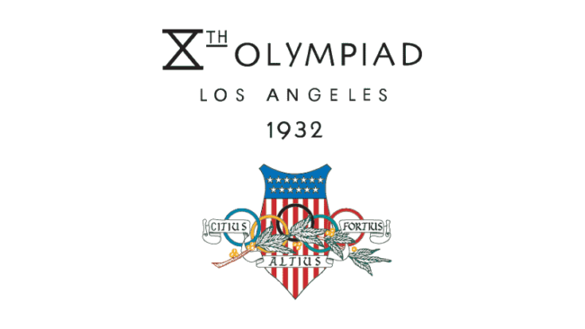

A visual disaster; combining the rings, a laurel leaf and the American shield in an overlapping pattern is impossible.  The typography goes on its own unrelated way.

*Score: 25 out of 100*

---

### Garmisch-Partenkirchen – Winter Olympics 1936

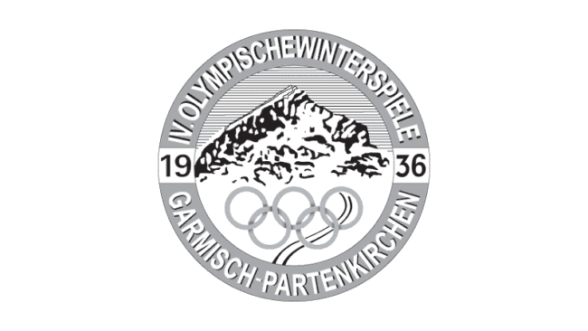

Banal and without any graphic intensity, but at least understandable.

*Score: 40 out of 100*

---

### Berlin – Summer Olympics 1936

Strange and lacking focus. The Olympic rings become subordinated to the eagle and bell forms. The spirit of the Olympics is totally absent.

*Score: 20 out of 100*

---

### St. Moritz – Winter Olympics 1948

A curious solution that looks like a travel brochure cover. All the elements refuse to relate to one another. The effect is ordinary and dull.

*Score: 30 out of 100*

---

### London – Summer Olympics 1948

This logo reveals that not all images will work together. The rings and parliament remain unrelated. The typography is sad.

*Score: 37 out of 100*

---

### Oslo – Winter Olympics 1952

The architectural form behind the rings remains a mystery, but overlapping them has little merit. There is no excitement here.

*Score: 39 out of 100*

---

### Helsinki – Summer Olympics 1952

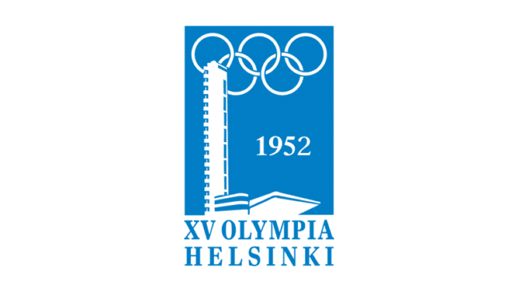

The peculiarity between the architecture and the rings in this case becomes strangely memorable. At best it is clear. The combination of blue and white is pleasant.

*Score: 40 out 100*

---

### Cortina d’Ampezzo  – Winter Olympics 1956

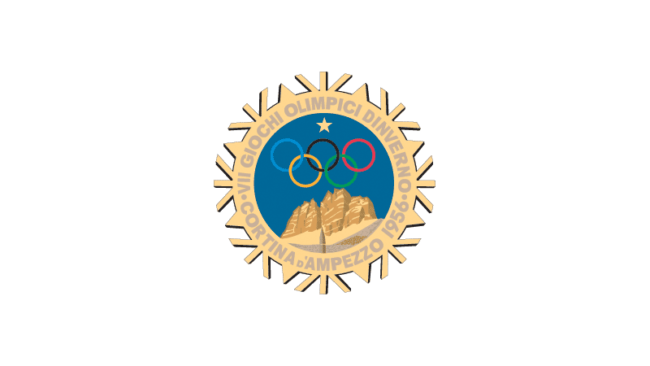

The natural rendering of the mountains combines well with the Olympic rings. The complex edge of the logo creates some energy, but the complexity is unpleasant. There is an all-over sense of fussiness.

*Score: 45 out 100*

---

### Melbourne – Summer Olympics 1956

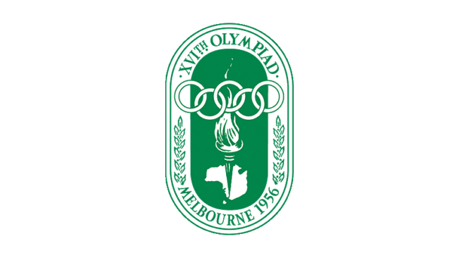

Resembles a bookplate more than an Olympic event. Too many elements involved; the torch, the continent, the rings, the lozenge, and laurel leaves. Too much of everything.

*Score: 35 out of 100*

---

### Squaw Valley, California – Winter 1960

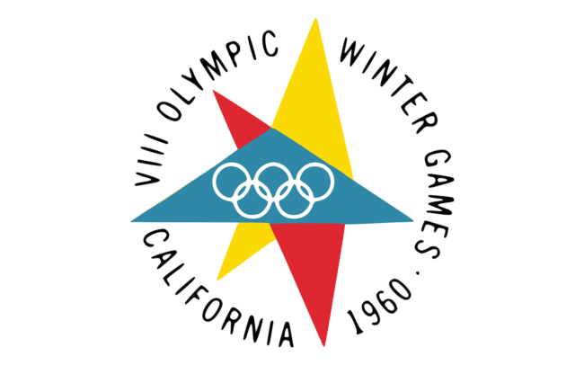

Not bad. The star form is distinctive and unusual. It contains the rings effectively and plays well against the circle of typography. It has a fresh look to it.

*Score: 80 out 100*

---

### Rome – Summer Olympics 1960

Combining the symbol of Rome, the date and the rings in a single sculptural image works here. It has strength and memorability.

*Score: 80 out 100*

---

### Innsbruck – Winter Olympics 1964

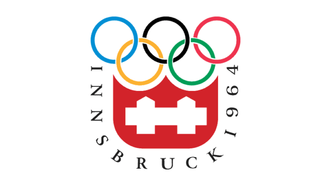

A clear arrangement of elements although the white form which is derived from the coat of arms of Innsbruck would be incomprehensible to the average viewer. The typography really doesn’t want to curve around that way.

*Score: 70 out of 100*

---

### Tokyo – Summer Olympics 1964

Appropriately redacted and without any confusion. The parts fit.

*Score: 92 out 100*

---

### Grenoble – Winter Olympics 1968

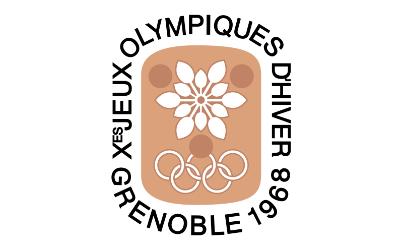

The mark seems overly decorative with the flower form conveying little information. It feels more like a fashion event than a sport competition.

*Score: 60 out of 100*

---

### Mexico – Summer 1968

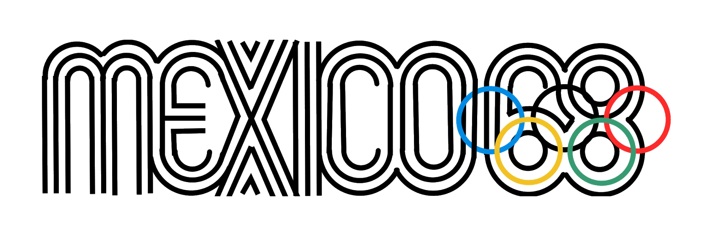

The graphic idea is strong, but the detail of execution creates an illegible element where the 68 engage the Olympic rings. On the other hand, there is a visual excitement here.

*Score: 80 out of 100*

---

### Sapporo – Winter 1972

All the visual elements are put together in a clear and convincing layout. The stylized snowflake design adds distinction because it deviates from the other familiar elements of Olympic communications.

*Score: 80 out of 100*

---

### Munich – Summer 1972

This graphic icon eliminates all the historical references of the Olympics, most notably the rings [when the icon is used alone, which it often was]. It is a powerful abstraction, but could be used for almost any event. Because it seems unfocused on expressing the Olympics it’s hard to relate its effectiveness.

*Score: 50 out of 100*

---

### Montreal – Summer 1976

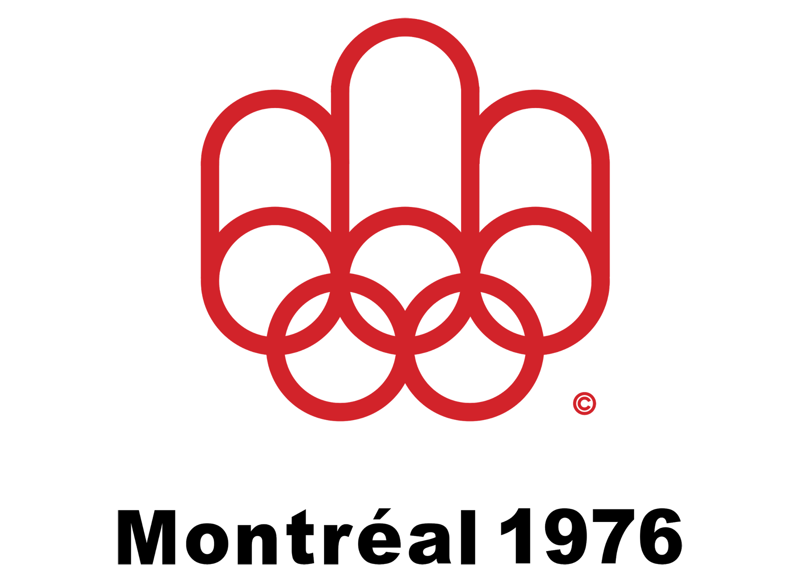

In this case the rings have been transformed into the initial ‘M’ for Montreal. This fact is of course impossible to understand by virtue of the logo itself. Does it matter if you can see the ‘M’? I think not. Nevertheless the mark is professional and clear. Perhaps more appropriate for a manufacturer of paper towels.

*Score: 70 out of 100*

---

### Lake Placid – Winter 1980

The origin of this mark was a reference to the Olympic column on the left combined with a mountain range in the Adirondacks. It produces a peculiar and finally unrecognizable form. It has some graphic energy, but the meaning is obscure and difficult to justify.

*Score: 50 out of 100*

---

### Moscow – Summer 1980

The Russian tower topped by a star and supported by the rings create an attenuated and unusual image. The typography [in later iterations] is clearly added on, unrelated to the image. Not very successful.

*Score: 40 out of 100*

---

### Sarajevo – Winter 1984

The introduction of a snowflake-like image seems to have a more editorial content than is obvious; we are puzzled by the peculiar construction of the snowflake and wonder about its meaning. Fortunately the combination of the rings and the words ‘Sarajevo ‘84’ [which was added in other versions] are straightforward.

*Score: 60 out of 100*

---

### Los Angeles – Summer 1984

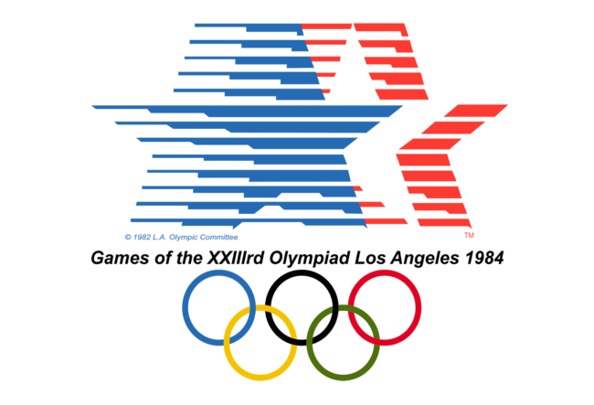

The moving stars is effectively done and unexpected. The other elements are directly added and do not feel out of place.

*Score: 80 out of 100*

---

### Calgary – Winter 1988

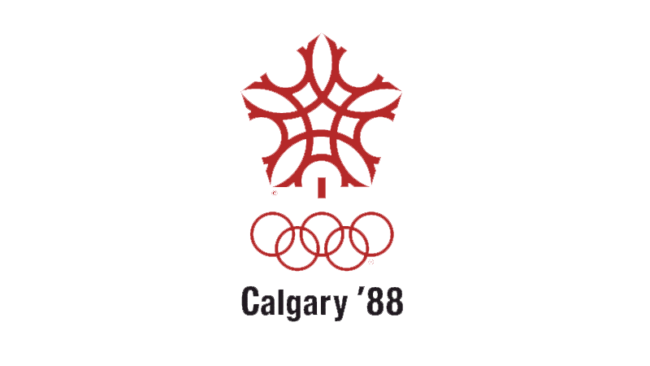

Justification for the trademark is the letter ‘C’ and ‘Canada’. Unfortunately the resulting form looks more Islamic than Olympic.

*Score: 50 out of 100*

---

### Seoul – Summer 1988

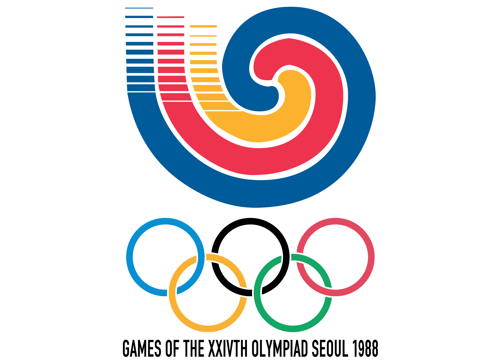

Although the mark is unfamiliar, it has significant impact and relates to the rings below. As a result, the entire visualization feels harmonious.

*Score: 75 out of 100*

---

### Albertville – Winter 1992

This design feels it’s trying too hard. The ‘x’ over the flame with the blue and red stroke below is confusing. The thin lines around the flame seem extraneous. The mark has the benefit of being clear.

*Score: 60 out of 100*

---

### Barcelona – Summer 1992

This mark is unexpectedly convincing. The 3 strokes representing the human figure have a good scale relationship to the world ‘Barcelona ’92’ and the rings.

*Score: 85 out of 100*

---

### Lillehammer – Winter 1994

It’s very difficult to understand the white architectural image in the blue box unless it’s a stadium. The idea of the aurora borealis was an opportunity not to taken advantage of. Putting the words to ‘Lillehammer ’94’ under the rings helps the coherence of the mark.

*Score: 70 out of 100*

---

### Atlanta – Summer 1996

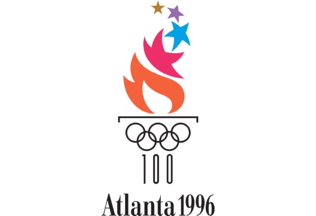

After one deduces that the image is of a Greek column supporting firey stars, the feeling remains that the attempt is too clever for its own good. Finally it doesn’t hold together as a single experience.

*Score: 60 out of 100*

---

### Nagano – Winter 1998

The flower image made out of bodies in motion is convincing and active. It feels like an event that you want to attend, and harmonized well with the typography and the Olympic rings.

*Score: 80 out of 100*

---

### Sydney – Summer 2000

The gestural quality of the drawing and the typography makes the entire mark feel harmonious.

*Score: 78 out of 100*

---

### Salt Lake City – Winter 2002

The image of a snowflake is executed here to represent the sun over a mountain and to reflect the colors of the local landscape. This may not be attainable, but the mark is well executed and professional.

*Score: 70 out of 100*

---

### Athens – Summer 2004

The olive branch representing the games is executed in a fresh and unexpected way. Because it looks less like a corporate logo, we feel more affectionate toward it. The blue feels right reflecting both the event and Athens at the same time.

*Score: 90 out of 100*

---

### Torino – Winter 2006

This mark is ambiguous and difficult to understand; a relationship to technology is insufficient. It attempts to appear contemporary, but it’s finally unconvincing.

*Score: 40 out of 100*

---

### Beijing – Summer 2008

The brush like quality of white figure on the red field and the lettering both convey the sense of Chinese calligraphy. The elements work together without difficulty.

*Score: 85 out of 100*

---

### Vancouver – Winter 2010

The ambiguity of the central figure once again creates some difficulty in understanding. To most viewers I suspect it will not immediately or inevitably represent Canada. In graphic terms, it is attractive and works in the layout.

*Score: 70 out of 100*

---

### London – Summer 2012

Like all transgressions, this treatment causes controversy. As an assembly of forms, I find it unattractive. But, because of its aggression, it persists in memory. It raises the old question of the struggle between novelty and familiarity.

*Score: 80 out of 100*

---

### Sochi – Winter Olympics 2014

This deviation from the assumptions of the historical Olympic logos cannot be criticized within the same framework as all the others. Although I must admit in my point of view, it seems inappropriate and unattractive. Consequently, I don’t feel it generates a desire to attend the event by virtue of its appearance on its own.

*Score: 40 out of 100*

---

### Rio – Summer 2016

A presentation that looks fresh and contemporary. The athletes joining hands at the top are executed in a way that works well with the other elements. It feels like something new.

*Score: 85 out of 100*

---

### PyeongChang – Winter 2018

This design raises the old question of how important it is that the references created by the symbol are understood by the audiences that witness them. In this case, the complexity surrounding the origin of the mark makes the understanding unlikely. Additionally, there is a sense of fragmentation that interferes with understanding.

*Score: 60 out of 100*

---

### Tokyo – Summer 2020

There is too much conflict about the final choice for the Tokyo Olympics 2020 logo, but the issue has raised some fascinating questions about the nature of plagiarism in the graphic arts.

*Score: TBD*

---

### Beijing – Winter Olympics 2022

In this example, the attempt to unify the image and the number 2022 has resulted in making the number ‘2’ look like a ‘Z’. When some problems are solved, others are created. Understanding the meaning of the image at the moment is difficult.

*Score: 60 out of 100*

---
